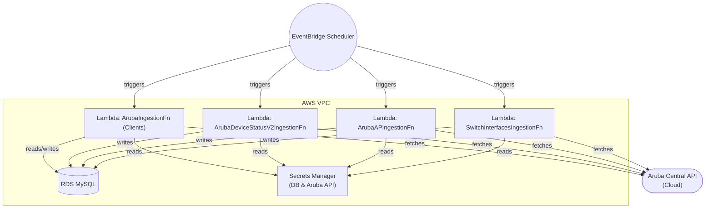

# Aruba Network Central Ingestion AWS CDK Solution
## Ingestion of Clients, Device Status v2, APs/WLANs into SQL Database using a JSON-Aligned Schema

Scheduled AWS Lambdas that ingests Aruba Netowkr Central (new) client data and (optionally) device status v2 data into a MySQL (RDS) database inside an existing VPC.  
The clients table mirrors Aruba Central JSON key names (camelCase) plus internal site fields. A separate append‑only `device_status` table captures periodic device status snapshots from the v2 API.
The original goal was to output all this data to individual S3 json objects or cloudwatch log stream json objects so that an AI vector database could be built and a customer controlled AI chatbot RAG system could then analyze and query this data.  This increased cost and complexity, so this interim sql output approach was built so that the data could be immediately accessible via a cheap and powerful sql querying engine.

## Architecture

### Solution Topology



**Legend:**
- All Lambdas run inside the VPC (private subnets)
- EventBridge schedules periodic Lambda invocations
- Lambdas fetch Aruba Central data, write to RDS, and use Secrets Manager for credentials
- All network egress to Aruba Central API is via NAT/IGW
- Existing VPC (supplied via CDK context)
- Private RDS MySQL (no public access)
- AWS Secrets Manager: DB credentials + Aruba API credentials
- Python Lambdas (urllib, PyMySQL) on EventBridge schedules
  - `ArubaIngestionFn` (clients)
  - `ArubaDeviceStatusV2IngestionFn` (device status v2)
  - `ArubaAPIngestionFn` (APs, radios, WLANs, ports, modems)

created_at TIMESTAMP

## Prerequisites
- VPC with:
  - ≥2 subnets (different AZs) for RDS
  - Subnets with egress (NAT/IGW) for Lambda to reach Aruba Central
- AWS CLI + credentials
- AWS CDK bootstrapped in target account/region
- Python 3.11+
- Aruba Central API client credentials (clientId + clientSecret; optional customerId)


## Deploying with AWS CDK (CloudShell, Console, or CLI)

You can deploy this solution from AWS CloudShell, the AWS Console, or your local CLI. The steps below work for all environments:

1. **(If using CloudShell/Console) Upload and unzip the project:**
   - Open AWS CloudShell (top right, terminal icon in the AWS Console).
   - Click the upload icon and select your zipped project folder (e.g., `aruba-central-cdk-ingestion.zip`).
   - Unzip and enter the project directory:
     ```bash
     unzip aruba-central-cdk-ingestion.zip
     cd aruba-central-cdk-ingestion
     ```

2. **Set up Python environment:**
   ```bash
   python3 -m venv .venv
   source .venv/bin/activate
   pip install --upgrade pip
   pip install -r requirements.txt
   ```

3. **Install AWS CDK (if not already installed):**
   ```bash
   npm install -g aws-cdk
   ```

4. **Bootstrap your AWS environment for CDK (run once per account/region):**
   ```bash
   export AWS_ACCOUNT_ID=$(aws sts get-caller-identity --query Account --output text)
     -c vpcId=vpc-0123456789abcdef0 \
     -c lambdaSubnetIds=subnet-aaa,subnet-bbb \
     -c dbSubnetIds=subnet-ccc,subnet-dddd \
     -c mysqlVersion=8.0.34
   ```

**Required context keys:**
- `vpcId`: The VPC ID where resources will be deployed
- `lambdaSubnetIds`: Comma-separated list of private subnet IDs for Lambdas
- `dbSubnetIds`: Comma-separated list of private subnet IDs for RDS (at least 2)
- `environment`: Environment label (e.g., dev, prod)
- `mysqlVersion`: MySQL engine version string (e.g., 8.0.34)

**Optional context keys:**
- `instanceType`: Override the default Lambda instance type (default: t3.micro for RDS)
- `backupRetentionDays`: Number of days to retain RDS backups (default: 7 for prod, 1 for others)
- `removalPolicy`: RDS removal policy (`SNAPSHOT` for prod, `DESTROY` for others)
- `logRetentionDays`: CloudWatch log retention in days (default: 14)
- `apIngestionScheduleMinutes`: AP ingestion schedule in minutes (default: 30)
- `deviceStatusIngestionScheduleMinutes`: Device status ingestion schedule in minutes (default: 30)
- `switchIngestionScheduleMinutes`: Switch interface ingestion schedule in minutes (default: 30)
- `dbAllocatedStorage`: RDS allocated storage in GB (default: 20)
- `multiAz`: Enable Multi-AZ for RDS (default: false)
- `publiclyAccessible`: Make RDS publicly accessible (default: false)

You can set these with `-c key=value` on the `cdk deploy` command or in your `cdk.json` for persistent configuration. Most users will not need to override these unless customizing for scale, cost, or compliance.

### Example Queries

Show devices currently down (status not 'Up'):
```sql
WITH latest_status AS (
  SELECT *,
         ROW_NUMBER() OVER (PARTITION BY deviceId ORDER BY lastSeenAt DESC, created_at DESC) AS rn
  FROM device_status
)
SELECT deviceId, deviceName, status, lastSeenAt
FROM latest_status
WHERE rn = 1 AND status != 'Up'
ORDER BY lastSeenAt DESC;
```

Show the count of failed clients grouped by role:
```sql
SELECT role, COUNT(*) AS failed_clients
FROM clients
WHERE status = 'Failed'
GROUP BY role
ORDER BY failed_clients DESC;
```

List all APs, their name, WLAN name, site name, and BSSID:
```sql
SELECT ap.serial AS ap_serial, ap.name AS ap_name, ap.site_name, ap_wlan.wlan_name, ap_wlan.bssid
FROM ap
JOIN ap_wlan ON ap.serial = ap_wlan.ap_serial
ORDER BY ap.name ASC, ap_wlan.wlan_name ASC, ap_wlan.bssid ASC;
```

List BSSIDs for a set of AP names and WLANs:
```sql
SET @ap_names = 'ap1,ap2,ap3';
SET @wlan_names = 'SSID1,SSID2';
SELECT ap.name AS ap_name, ap_wlan.wlan_name, ap_wlan.bssid
FROM ap
JOIN ap_wlan ON ap.serial = ap_wlan.ap_serial
WHERE FIND_IN_SET(ap.name, @ap_names) > 0
  AND FIND_IN_SET(ap_wlan.wlan_name, @wlan_names) > 0
ORDER BY ap.name ASC, ap_wlan.wlan_name ASC, ap_wlan.bssid ASC;
```
- Append‑only historical storage (NO upserts / uniqueness)
  - Queries derive “current” view using window functions


## Database Table Schemas

### AP Table
| Column      | Type                              | Notes         |
|-------------|-----------------------------------|---------------|
| id          | BIGINT AUTO_INCREMENT PRIMARY KEY |               |
| serial      | VARCHAR(64) NOT NULL UNIQUE       | Indexed       |
| name        | VARCHAR(255)                      |               |
| model       | VARCHAR(64)                       |               |
| status      | VARCHAR(32)                       |               |
| ip_address  | VARCHAR(45)                       |               |
| mac_address | VARCHAR(32)                       |               |
| site_id     | VARCHAR(64)                       |               |
| site_name   | VARCHAR(255)                      |               |
| sw_version  | VARCHAR(64)                       |               |
| uptime      | BIGINT                            |               |
| cluster_name| VARCHAR(255)                      |               |
| public_ip   | VARCHAR(45)                       |               |
| created_at  | TIMESTAMP DEFAULT CURRENT_TIMESTAMP |             |
| updated_at  | TIMESTAMP DEFAULT CURRENT_TIMESTAMP ON UPDATE CURRENT_TIMESTAMP | |
| INDEX idx_serial | (serial)                     |               |

### AP Radio Table
| Column        | Type                              | Notes         |
|---------------|-----------------------------------|---------------|
| id            | BIGINT AUTO_INCREMENT PRIMARY KEY |               |
| ap_serial     | VARCHAR(64) NOT NULL              | FK to ap(serial) |
| radio_index   | INT                               |               |
| mac_address   | VARCHAR(32)                       |               |
| band          | VARCHAR(16)                       |               |
| channel       | VARCHAR(16)                       |               |
| bandwidth     | VARCHAR(16)                       |               |
| status        | VARCHAR(16)                       |               |
| radio_number  | INT                               |               |
| mode          | VARCHAR(32)                       |               |
| antenna       | VARCHAR(32)                       |               |
| spatial_stream| VARCHAR(16)                       |               |
| power         | INT                               |               |
| created_at    | TIMESTAMP DEFAULT CURRENT_TIMESTAMP |             |

### AP WLAN Table
| Column        | Type                              | Notes         |
|---------------|-----------------------------------|---------------|
| id            | BIGINT AUTO_INCREMENT PRIMARY KEY |               |
| ap_serial     | VARCHAR(64) NOT NULL              | FK to ap(serial) |
| wlan_name     | VARCHAR(64)                       |               |
| security      | VARCHAR(64)                       |               |
| security_level| VARCHAR(64)                       |               |
| bssid         | VARCHAR(32)                       |               |
| vlan          | VARCHAR(16)                       |               |
| status        | VARCHAR(16)                       |               |
| created_at    | TIMESTAMP DEFAULT CURRENT_TIMESTAMP |             |

### AP Port Table
| Column       | Type                              | Notes         |
|--------------|-----------------------------------|---------------|
| id           | BIGINT AUTO_INCREMENT PRIMARY KEY |               |
| ap_serial    | VARCHAR(64) NOT NULL              | FK to ap(serial) |
| port_name    | VARCHAR(32)                       |               |
| port_index   | INT                               |               |
| mac_address  | VARCHAR(32)                       |               |
| status       | VARCHAR(16)                       |               |
| vlan_mode    | VARCHAR(16)                       |               |
| allowed_vlan | VARCHAR(32)                       |               |
| native_vlan  | VARCHAR(16)                       |               |
| access_vlan  | VARCHAR(16)                       |               |
| speed        | VARCHAR(16)                       |               |
| duplex       | VARCHAR(16)                       |               |
| connector    | VARCHAR(16)                       |               |
| created_at   | TIMESTAMP DEFAULT CURRENT_TIMESTAMP |             |

### AP Modem Table
| Column            | Type                              | Notes         |
|-------------------|-----------------------------------|---------------|
| id                | BIGINT AUTO_INCREMENT PRIMARY KEY |               |
| ap_serial         | VARCHAR(64) NOT NULL              | FK to ap(serial) |
| manufacturer      | VARCHAR(64)                       |               |
| sim_state         | VARCHAR(32)                       |               |
| status            | VARCHAR(16)                       |               |
| state             | VARCHAR(16)                       |               |
| model             | VARCHAR(64)                       |               |
| imei              | VARCHAR(32)                       |               |
| imsi              | VARCHAR(32)                       |               |
| iccid             | VARCHAR(32)                       |               |
| firmware_version  | VARCHAR(64)                       |               |
| access_technology | VARCHAR(32)                       |               |
| bandwidth         | VARCHAR(16)                       |               |
| band              | VARCHAR(16)                       |               |
| created_at        | TIMESTAMP DEFAULT CURRENT_TIMESTAMP |             |


### Device Status Table

### Clients Table
| Column                | Type         | Notes |
|-----------------------|--------------|-------|
| id                    | BIGINT NOT NULL AUTO_INCREMENT PK |       |
| mac                   | VARCHAR(17) NOT NULL |       |
| _site_id              | VARCHAR(64) NOT NULL |       |
| _site_name            | VARCHAR(255) |       |
| name                  | VARCHAR(255) |       |
| status                | VARCHAR(50)  |       |
| experience            | VARCHAR(50)  |       |
| statusReason          | VARCHAR(120) |       |
| capabilities          | TEXT         |       |
| authentication        | VARCHAR(100) |       |
| type                  | VARCHAR(40)  |       |
| ipv4                  | VARCHAR(45)  |       |
| ipv6                  | VARCHAR(45)  |       |
| vlanId                | VARCHAR(16)  |       |
| network               | VARCHAR(100) |       |
| connectedDeviceSerial | VARCHAR(64)  |       |
| connectedTo           | VARCHAR(255) |       |
| tunnelId              | VARCHAR(64)  |       |
| tunnel                | VARCHAR(64)  |       |
| role                  | VARCHAR(100) |       |
| port                  | VARCHAR(64)  |       |
| keyManagement         | VARCHAR(100) |       |
| connectedSince        | DATETIME     |       |
| lastSeenAt            | DATETIME     |       |
| created_at            | TIMESTAMP    | ingest time |
| updated_at            | TIMESTAMP    | auto  |

Indexes:
- idx_site_mac (_site_id, mac)
- idx_site_lastSeenAt (_site_id, lastSeenAt)
- idx_site_connectedSince (_site_id, connectedSince)
- idx_site_created (_site_id, created_at)

Notes:
- No UNIQUE index (append-only).
- Each Lambda run inserts a full snapshot of the window (NOT just currently connected).
- lastSeenAt fallback: if API returns "0"/0/None, we substitute connectedSince.

### Device Status Table
| Column                | Type         | Notes |
|-----------------------|--------------|-------|
| id                    | BIGINT NOT NULL AUTO_INCREMENT PK |       |
| _site_id              | VARCHAR(64)  |       |
| _site_name            | VARCHAR(255) |       |
| deviceId              | VARCHAR(64)  |       |
| serialNumber          | VARCHAR(64)  |       |
| macAddress            | VARCHAR(32)  |       |
| deviceName            | VARCHAR(255) |       |
| model                 | VARCHAR(64)  |       |
| partNumber            | VARCHAR(64)  |       |
| status                | VARCHAR(32)  |       |
| softwareVersion       | VARCHAR(64)  |       |
| ipv4                  | VARCHAR(45)  |       |
| ipv6                  | VARCHAR(45)  |       |
| role                  | VARCHAR(64)  |       |
| deviceType            | VARCHAR(64)  |       |
| deployment            | VARCHAR(64)  |       |
| persona               | VARCHAR(64)  |       |
| deviceFunction        | VARCHAR(64)  |       |
| uptimeInMillis        | BIGINT       |       |
| lastSeenAt            | DATETIME     |       |
| configLastModifiedAt  | DATETIME     |       |
| created_at            | TIMESTAMP    | ingest time |
| updated_at            | TIMESTAMP    | auto  |

Indexes:
- idx_dev_site (_site_id, deviceId)
- idx_dev_site_status (_site_id, status)
- idx_dev_site_lastSeen (_site_id, lastSeenAt)
- idx_dev_site_created (_site_id, created_at)
| created_at            | TIMESTAMP    | ingest time |
| updated_at            | TIMESTAMP    | auto  |

Indexes:
  idx_dev_site (_site_id, deviceId)
  idx_dev_site_status (_site_id, status)
  idx_dev_site_lastSeen (_site_id, lastSeenAt)
  idx_dev_site_created (_site_id, created_at)

Notes:
- Append‑only snapshots (no dedupe/upsert).
- `deviceId` / `macAddress` may both exist; use whichever is stable as key in analytical queries.
- For a "latest device state" view use ROW_NUMBER() over deviceId ordered by lastSeenAt/created_at.

### Switch Interface Details Table
| Column                    | Type         | Notes |
|---------------------------|--------------|-------|
| _id                       | BIGINT NOT NULL AUTO_INCREMENT PK |       |
| _site_id                  | VARCHAR(128) |       |
| _site_name                | VARCHAR(255) |       |
| switch_serial             | VARCHAR(64)  |       |
| created_at                | DATETIME     |       |
| updated_at                | DATETIME     |       |
| neighbourPort             | VARCHAR(64)  |       |
| neighbourFamily           | VARCHAR(64)  |       |
| index                     | INT          |       |
| vlanMode                  | VARCHAR(32)  |       |
| module                    | VARCHAR(64)  |       |
| nativeVlan                | VARCHAR(32)  |       |
| neighbourSerial           | VARCHAR(64)  |       |
| speed                     | VARCHAR(32)  |       |
| isMultipleNeighbourClients| TINYINT      |       |
| duplex                    | VARCHAR(16)  |       |
| name                      | VARCHAR(128) |       |
| connector                 | VARCHAR(32)  |       |
| type                      | VARCHAR(32)  |       |
| transceiverStatus         | VARCHAR(32)  |       |
| stpInstanceType           | VARCHAR(32)  |       |
| stpInstanceId             | VARCHAR(32)  |       |
| stpPortRole               | VARCHAR(32)  |       |
| stpPortState              | VARCHAR(32)  |       |
| stpPortInconsistent       | VARCHAR(32)  |       |
| transceiverState          | VARCHAR(32)  |       |
| ipv4                      | VARCHAR(64)  |       |
| transceiverProductNumber  | VARCHAR(64)  |       |
| transceiverModel          | VARCHAR(64)  |       |
| transceiverSerial         | VARCHAR(64)  |       |
| errorReason               | VARCHAR(128) |       |
| adminStatus               | VARCHAR(32)  |       |
| operStatus                | VARCHAR(32)  |       |
| mtu                       | INT          |       |
| status                    | VARCHAR(32)  |       |
| transceiverType           | VARCHAR(32)  |       |
| neighbourType             | VARCHAR(32)  |       |
| neighbourHealth           | VARCHAR(32)  |       |
| neighbourRole             | VARCHAR(32)  |       |
| lag                       | VARCHAR(32)  |       |
| allowedVlans              | TEXT         |       |
| allowedVlanIds            | TEXT         |       |
| poeStatus                 | VARCHAR(32)  |       |
| alias                     | VARCHAR(64)  |       |
| description               | VARCHAR(255) |       |
| poeClass                  | VARCHAR(32)  |       |
| portAlignment             | VARCHAR(32)  |       |
| serial                    | VARCHAR(64)  |       |
| id                        | VARCHAR(64)  |       |
| peerPort                  | VARCHAR(64)  |       |
| peerMemberId              | VARCHAR(64)  |       |
| uplink                    | VARCHAR(32)  |       |
| portError                 | VARCHAR(128) |       |
| neighbour                 | VARCHAR(128) |       |
| neighbourFunction         | VARCHAR(64)  |       |

Notes:
- Append‑only switch interface detail snapshots
- Primary key is `_id` (auto-increment), separate from the `id` field which contains interface identifiers
- Large table with many detailed interface attributes
| keyManagement             | VARCHAR(100) |       |
| connectedSince            | DATETIME     |       |
| lastSeenAt                | DATETIME     |       |
| created_at                | TIMESTAMP    | ingest time |
| updated_at                | TIMESTAMP    | auto  |

Indexes:
  idx_site_mac (_site_id, mac)
  idx_site_lastSeenAt (_site_id, lastSeenAt)
  idx_site_connectedSince (_site_id, connectedSince)
  idx_site_created (_site_id, created_at)

Notes:
- No UNIQUE index (append-only).
- Each Lambda run inserts a full snapshot of the window (NOT just currently connected).
- lastSeenAt fallback: if API returns "0"/0/None, we substitute connectedSince.

## Data Growth & Strategy
- Historical growth is linear with run frequency × average entities (clients + devices).


## Troubleshooting


| Symptom                                   | Cause                                   | Action                                                        |
|--------------------------------------------|-----------------------------------------|---------------------------------------------------------------|
| Excess records vs “active” count           | Lookback window includes disconnected clients | Reduce ARUBA_CLIENT_LOOKBACK_MINUTES                      |
| Many pages (hundreds) for small active set | MAC rotation / historical window         | Narrow statuses to Connected; shorten lookback                |
| 429 errors                                | Rate limits                             | Increase ARUBA_MIN_REQUEST_INTERVAL_SEC, lower ARUBA_PAGE_SIZE |
| NULL ipv4 / type                           | Key absent in this response variant      | Enable LOG_CLIENT_FIELD_GAPS, inspect logged keys             |
| Duplicate semantics                        | Append-only design                      | Post-query dedupe (ROW_NUMBER or latest lastSeenAt)           |


## Adjusting Collection Granularity
- To reduce volume: set ARUBA_CLIENT_LOOKBACK_MINUTES=10 (or lower) AND restrict statuses to Connected.
- To capture only current snapshot: lookback small (e.g., 5) and optionally filter by lastSeenAt age via ARUBA_CLIENT_LAST_SEEN_MAX_AGE_MIN.

## Security & Secrets
- Secrets fetched once per cold start and cached.
- Bearer fallback used if clientId absent (clientSecret treated as token).
- No inline plaintext secret logging (only masked or hashed samples).

## Change Log (Recent)
- Added dedicated `ArubaDeviceStatusV2IngestionFn` Lambda + `device_status` table.
- Added `ARUBA_DEVICE_STATUS_ENDPOINT` and `LOG_RAW_DEVICE_STATUS_SAMPLE` env vars.
- Migrated schema to JSON key names.
- Removed legacy snake_case columns & device ingestion (old path) prior to v2 device status.
- Added start-query-time lookback (minutes) for clients.
- Added fallback for lastSeenAt=="0" → connectedSince.
- Implemented robust pagination + rate limit/backoff.
- Append-only bulk insert (no ON DUPLICATE KEY).

## Cleanup
```
cdk destroy \
  -c environment=dev \
  -c vpcId=... \
  -c lambdaSubnetIds=... \
  -c dbSubnetIds=...
```

## Future Enhancements (Optional)
- Only an important subset of Aruba Network Central endpoint are currently being polled, this project can be easily expanded with additional lambda functions to query additional API endpoints for information currently missing, like administrator activity event logs
- Retention purge Lambda to remove records beyond a certain date.
- Snapshot (current-state) table build
- Metrics emission (CloudWatch custom metrics)
- Partitioning by date for large datasets

---